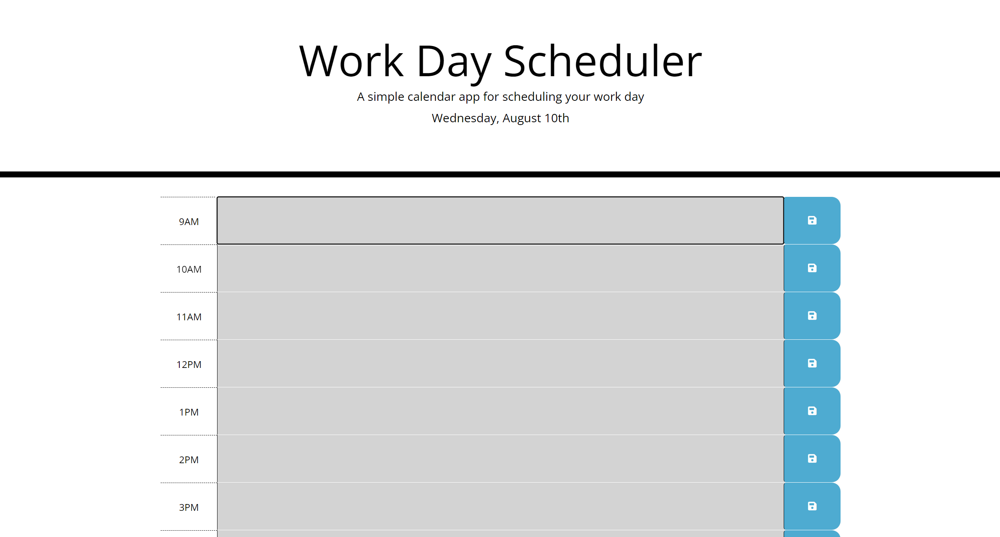

# 05 Third-Party APIs: Work Day Scheduler

This application is a simple work calendar that can be utilized to schedule events throughout a work day. 

Each event is saved to the local storage of the user with the typical 9 to 5 schedule.

This challenge is based off provided starter code and utilizes a "moment.js" library which incorporates a live date and time.

By utilizing a web browser it features a dynamic HTML & CSS that is powered by jQuery.

Each time slot is color coordinated representing either past, present or future events of the day within the time frame & day given.

Events can be saved, stored and deleted when the web browser is refreshed.


Github Page: https://bsayavong.github.io/05-Work-Day-Scheduler/
## User Story

```md
AS AN employee with a busy schedule
I WANT to add important events to a daily planner
SO THAT I can manage my time effectively
```

## Acceptance Criteria

```md
GIVEN I am using a daily planner to create a schedule
WHEN I open the planner
THEN the current day is displayed at the top of the calendar
WHEN I scroll down
THEN I am presented with timeblocks for standard business hours
WHEN I view the timeblocks for that day
THEN each timeblock is color coded to indicate whether it is in the past, present, or future
WHEN I click into a timeblock
THEN I can enter an event
WHEN I click the save button for that timeblock
THEN the text for that event is saved in local storage
WHEN I refresh the page
THEN the saved events persist
```

